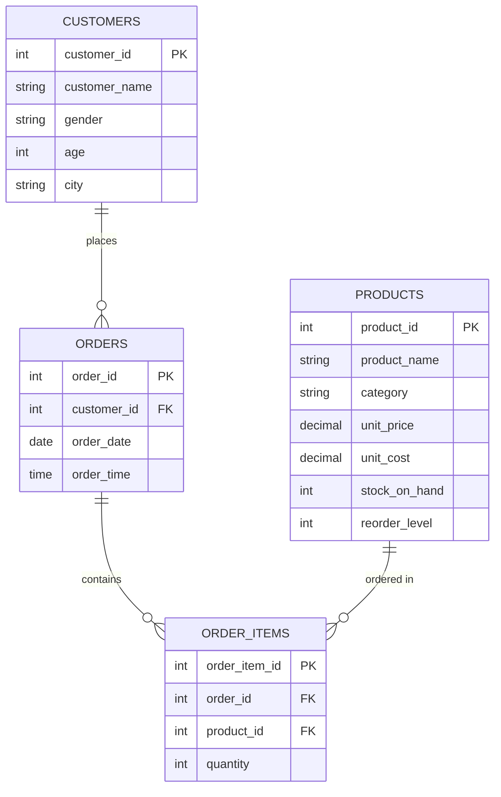

# Retail Sales SQL Analysis

SQL project analyzing a retail sales dataset — schema design, data cleaning, and business-question queries using MySQL.

## Schema / Entity Relationship Diagram

## What this project covers
- **Schema design**: A single `retail_sales` table capturing transactions, customers, categories, and pricing.
- **Data cleaning**: Identifying and removing incomplete rows, validating calculated fields.
- **Business analysis** via SQL:
  - Revenue and order volume by category
  - Top 5 customers by spend
  - Monthly average sale trends (seasonality)
  - Order volume by time of day
  - Category preference by gender
  - Customers with above-average order value (subquery)
  - Running total of revenue over time (window function)
  - Profit margin by category

## Tech
- MySQL 8.0+
- Concepts used: `GROUP BY`, `HAVING`, subqueries, `CASE`, window functions (`SUM() OVER`)

## File
- `retail_sales_analysis.sql` — full script: table creation → cleaning → 10 business-question queries

## How to run
1. Import your retail sales CSV into a MySQL table matching the schema in the script (or adapt column names).
2. Run `retail_sales_analysis.sql` section by section in MySQL Workbench or CLI.

## Sample dataset
Any public retail/sales dataset with columns for transaction ID, date, customer, category, quantity, price, and cost works (e.g., Kaggle retail sales datasets).
